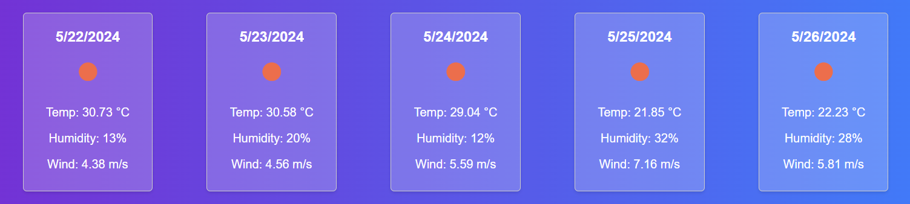

# Weather Dashboard

## Description

5-Day-Forecast is a web application that allows users to search for current and future weather conditions for multiple cities. It utilizes the OpenWeatherMap API to fetch weather data and displays it in a user-friendly manner with dynamic HTML and CSS. The application also saves search history using localStorage, enabling users to quickly access weather information for previously searched cities.

## Table of Contents

- [Installation](#installation)
- [Usage](#usage)
- [Features](#features)
- [Technologies Used](#technologies-used)
- [License](#license)
- [Example Usage](#example-usage)
- [Contributing](#contributing)
- [Acknowledgements](#acknowledgements)

## Installation

To set up the project locally, follow these steps:

1. Clone the repository:

    git clone https://github.com/yourusername/weather-dashboard.git

2. Navigate to the project directory:

    cd weather-dashboard

3. Open index.html in your preferred web browser.

## Usage

1. Open the Weather Dashboard: Open index.html in your web browser.

2. Search for a City: Enter the name of a city in the search input field and click the "Search" button.

3. View Current Weather: The current weather conditions for the searched city will be displayed, including temperature, humidity, wind speed, and an icon representing the weather conditions.

4. View 5-Day Forecast: The 5-day weather forecast for the city will also be displayed, showing the temperature, humidity, wind speed, and weather icons for each day.

5. Search History: The city name will be added to the search history. Click on any city name in the search history to view its weather data again.

## Features

- Search for Weather Data: Users can search for the weather data of any city worldwide.

- Current Weather Conditions: Displays the current weather, including temperature, humidity, wind speed, and weather icon.

- 5-Day Forecast: Provides a 5-day weather forecast with detailed daily weather information.

- Search History: Saves the history of searched cities in localStorage, allowing quick access to previous searches.

- Responsive Design: Optimized for both desktop and mobile viewing.

## Technologies Used

- HTML: Provides the structure of the web application.

- CSS: Styles the application for a visually appealing and responsive design.

- JavaScript: Implements the functionality of the weather search and data display.

- OpenWeatherMap API: Fetches the weather data for the searched cities.

Example Usage
Here’s a visual walkthrough of how to use the Weather Dashboard:

Search for a City:

View Current Weather:

View 5-Day Forecast:

Search History: